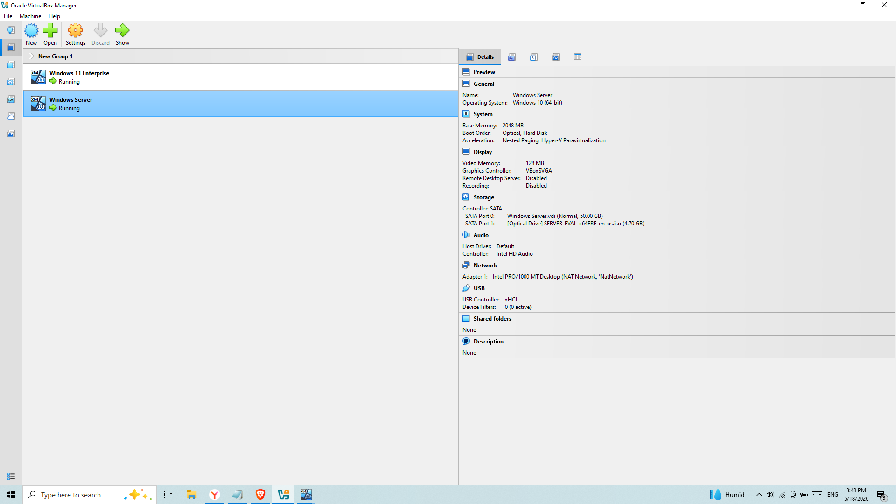
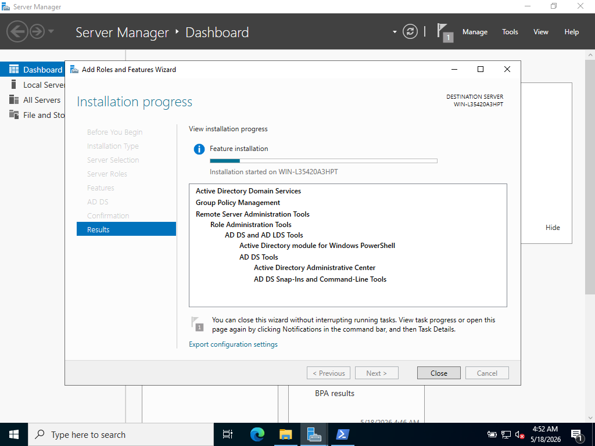
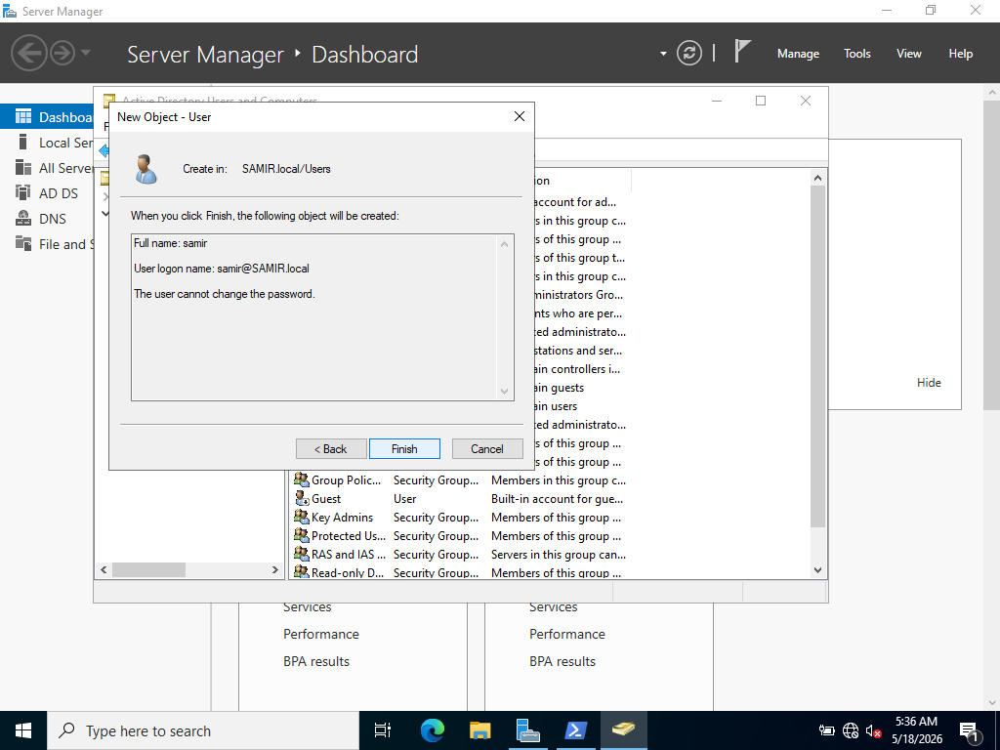
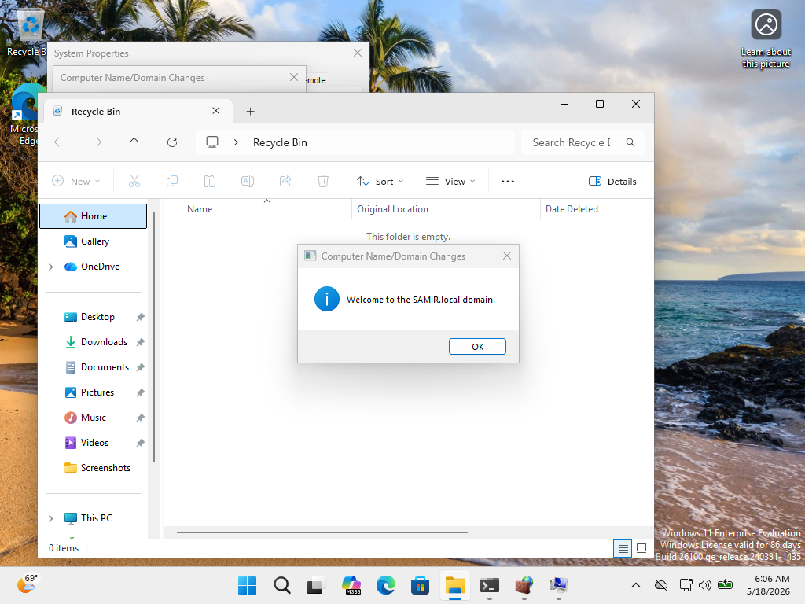
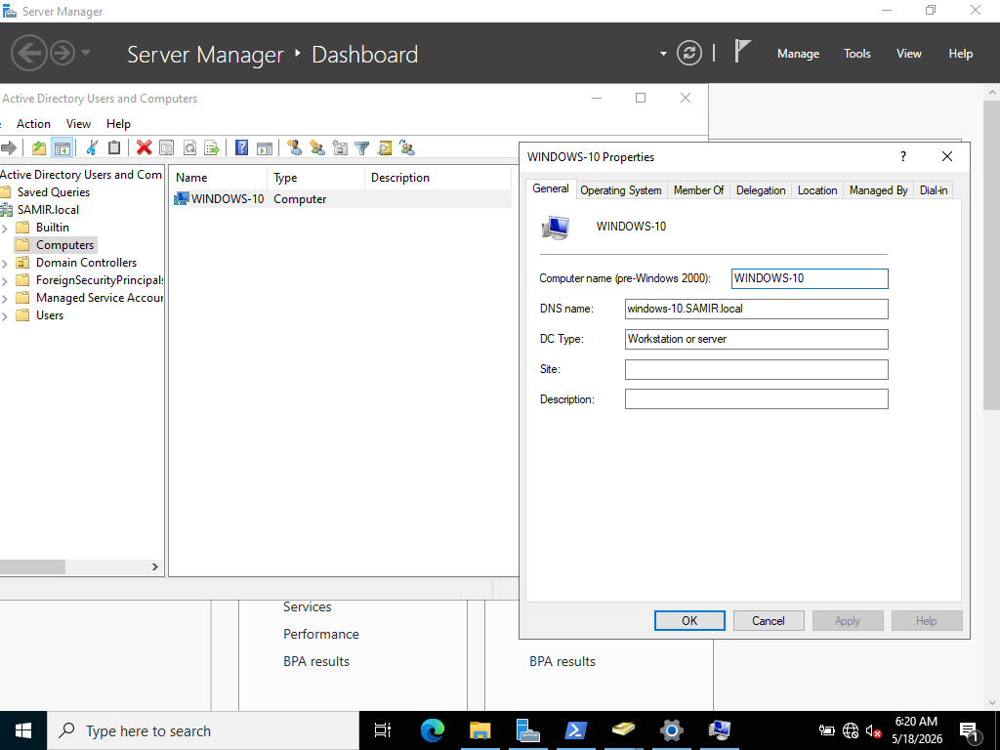

# Active Directory Domain Setup and Client Integration Lab

## Project Description

This project focused on building a basic enterprise Windows domain environment using Active Directory.

A Windows Server virtual machine was configured as a Domain Controller with a new forest and domain deployment.

A separate Windows 11 Enterprise client machine was successfully joined to the domain environment.

The project included:
- Active Directory Domain Services installation
- Domain Controller configuration
- Domain user creation
- Windows client domain integration
- Verification of joined systems through Active Directory Users and Computers

The goal of the lab was to gain hands-on experience with enterprise identity management and Windows domain administration in a virtualized environment.

---

## Tools Used

- Windows Server
- Windows 11 Enterprise
- Active Directory
- VirtualBox
- Server Manager

---

## Active Directory Lab Environment

### 1. VirtualBox Lab Infrastructure

This screenshot shows the virtual lab environment inside VirtualBox with two active virtual machines:
- Windows Server
- Windows 11 Enterprise

The environment was prepared for Active Directory deployment and domain integration testing.

---

### 2. Active Directory Domain Services Installation

This screenshot shows the installation process of Active Directory Domain Services on Windows Server.

The server is being configured as a Domain Controller to support centralized authentication and enterprise domain management.

---

### 3. Active Directory User Creation

This screenshot shows the creation of a new domain user inside Active Directory Users and Computers.

The account is intended for authentication and management operations within the enterprise lab environment.

---

### 4. Windows 11 Successfully Joined to Domain

This screenshot displays the successful domain join confirmation message after connecting the Windows 11 Enterprise machine to the Active Directory domain.

---

### 5. Verification of Joined Workstation in Active Directory

This screenshot shows Active Directory Users and Computers displaying the joined Windows 11 Enterprise workstation inside the Computers container.

This confirms successful enrollment of the client machine into the domain environment.

---

## Project Outcome

Successfully deployed a functional Active Directory domain environment using Windows Server and integrated a Windows 11 Enterprise client into the domain.

The project demonstrates practical experience with enterprise identity management, Windows infrastructure administration, domain integration, and Active Directory management workflows commonly used in corporate environments.
